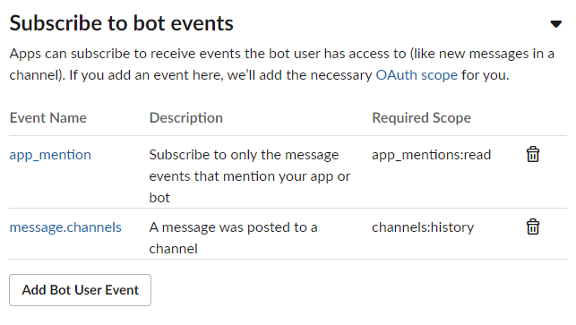
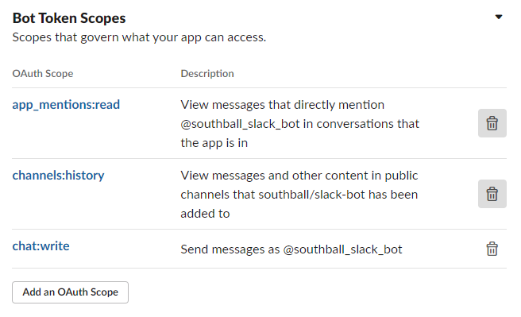

# Configuration

These are some of the configuration steps required for the bot to function
properly.

- An app-level token with the `connections:write` scope as `SLACK_APP_TOKEN` (in
  the "Basic Information" section) and the Bot User OAuth Token as
  `SLACK_BOT_TOKEN` (in the "OAuth & Permissions" page) is required.
- These event subscriptions are required in the "Socket Mode" section:
  
- These bot token scopes are required in the "OAuth & Permissions" section:
  
